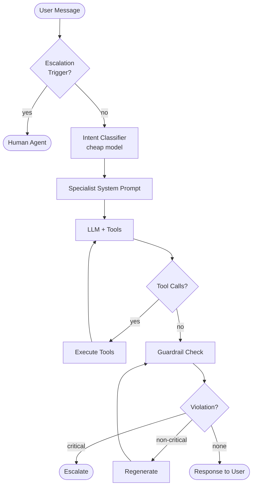
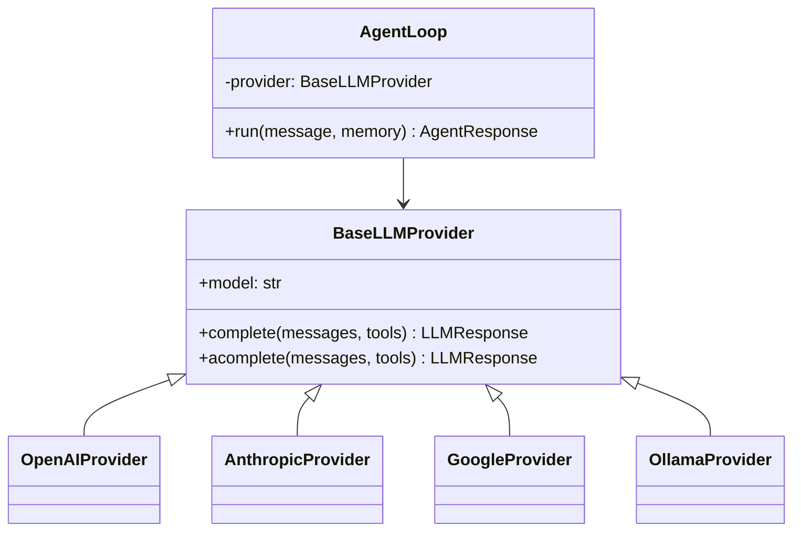
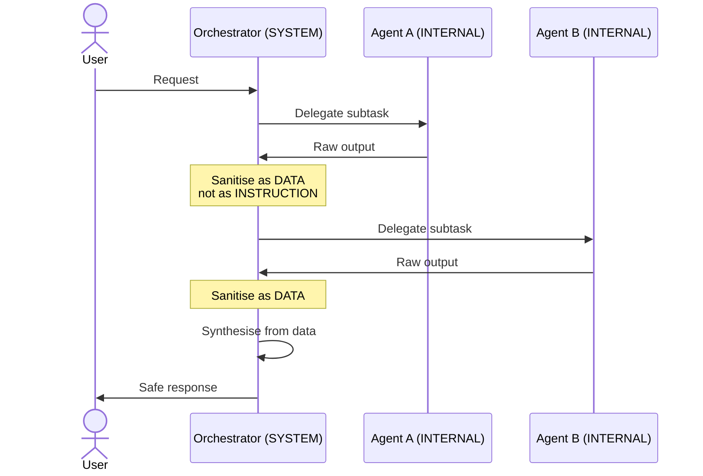
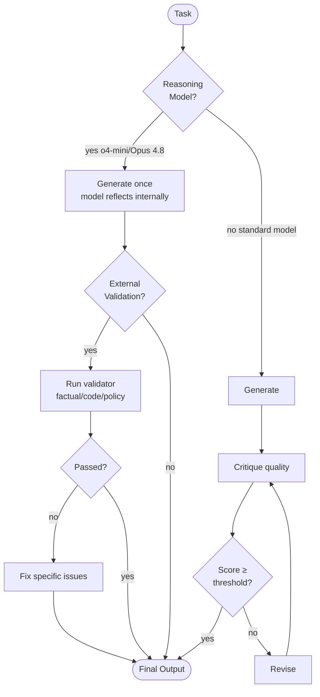
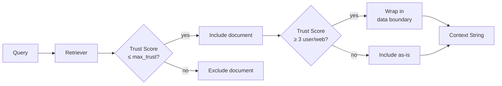

# Architecture Diagrams (Mermaid)

Copy any of these into https://mermaid.live to render.

## Agent Loop Flow

## Provider Abstraction

## Multi-Agent Trust Boundaries

## Reflection Pattern (Model-Aware)

## RAG Trust Filter

